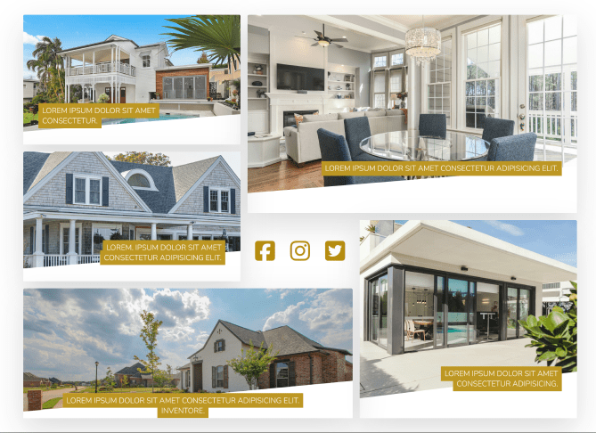
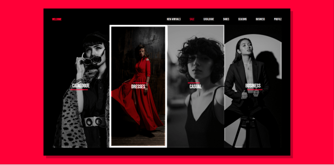
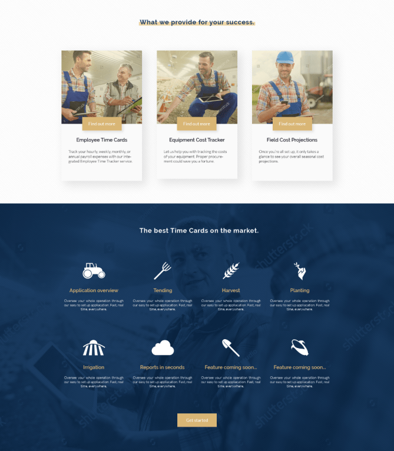
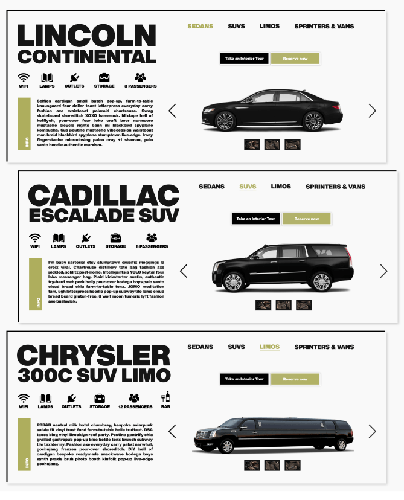
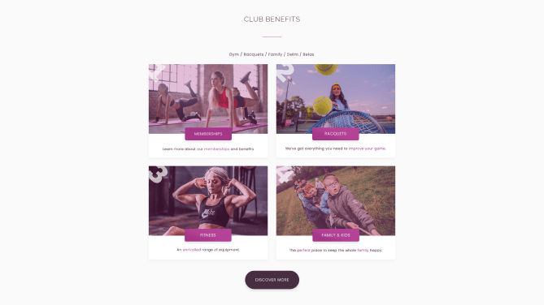
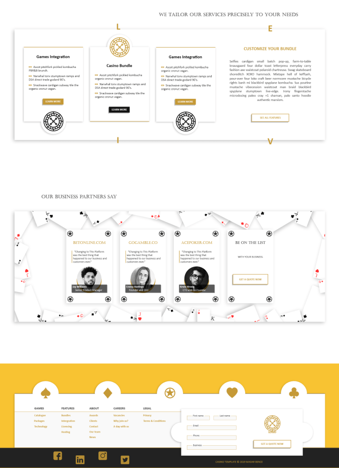
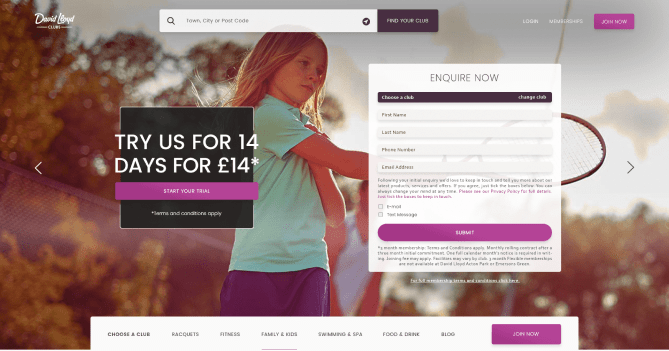
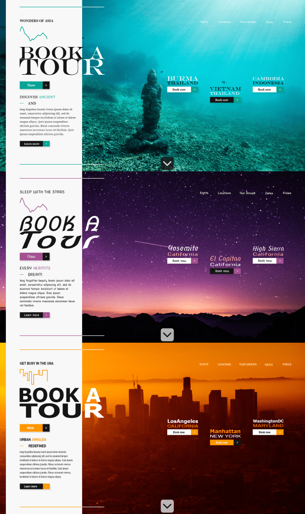
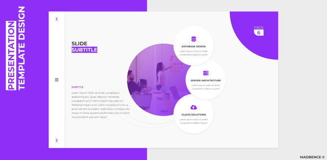

## CSS Designs, UI Sketches, PS Designs, concepts and more.

### Various designs, sketches and concepts from the past decade.

 

  
  
  
  
  
  
  
  
  
  
  
  
  

  
  
  
  
  
  
  
  
  
  
  

  
  
  
  
  
  
  
  
  
  
  
  

